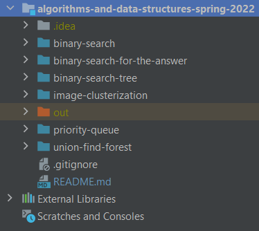
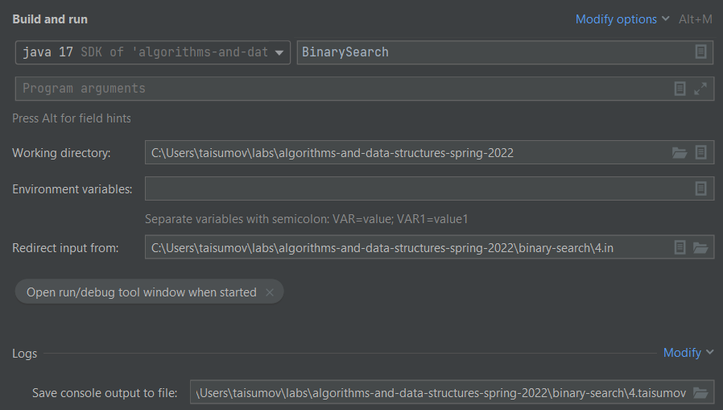

# Алгоритмы и структуры данных (2022)
В ходе работы над заданиями по данному предмету была организована следующая структура выполнения:

В качестве языка был выбран **Java**, соответственно,
в качестве IDE был выбран **IntellijIDEA**.

Репозиторий
[Algorithms and data structures Spring 2022](https://github.com/iposov/algorithms-and-data-structures-spring-2022)
был клонирован на локальный диск, все папки были определены как *Source Root*:

Затем в каждой папке были созданы классы, необходимые для решения задачи.

Ниже представлена таблица соотвествия входных и выходных файлов:

| Файл ввода | Файл вывода | Скомпилированный файл вывода  |
|:----------:|:-----------:|:-----------------------------:|
|    *.in    |    *.out    |          *.taisumov           |

С помощью `Edit Configurations > Modify Options` были переопределены вводы
и выводы для каждого класса:

После работы программы, выделив два файла вывода и нажав комбинацию `CTRL + D`
можно сравнить файлы и проверить корректность выполненной работы.