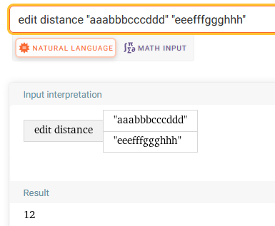
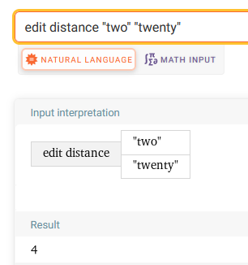
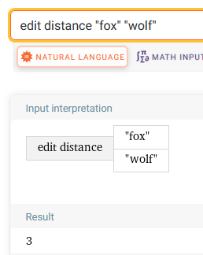

## edit-distance

Файлы `*.my.out` - перенаправленный стандартный вывод программы при вводе соответствующего теста. Сравнение с правильным выводом различий не показало, использовал встроенный инструмент сравнения CLion.

`main.cpp` - код программы.

### Тесты

Тест 1:

```
aaabbbcccddd
eeefffggghhh
```

Результат Wolfram Alpha:



Тест 2:

```
two
twenty
```

Результат Wolfram Alpha:



Тест 3

```
fox
wolf
```

Результат Wolfram Alpha:

